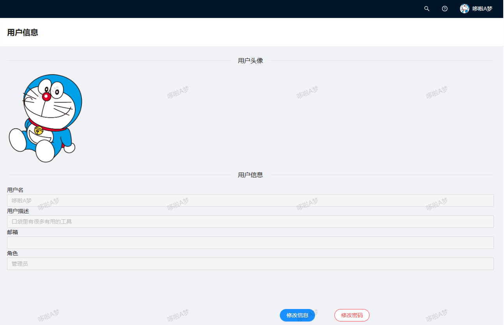

# 项目简单介绍

后端项目基于`MyBatis Plus`+`Spring Boot`搭建而成，具有用户注册、用户登录和用户管理功能 

前端项目基于`Ant Design Pro`搭建





# 数据库表设计

|   字段名    |       字段描述       |   类型   |
| :---------: | :------------------: | :------: |
|     id      |         主键         |   int    |
|  username   |         昵称         | varchar  |
| description |       用户描述       |          |
|  avatarUrl  |         头像         | varchar  |
| userAccount |         账号         | varchar  |
|  password   |         密码         | varchar  |
| userStatus  |         状态         |   int    |
| createTime  |       创建时间       | datetime |
| updateTime  |       更新时间       | datetime |
|  isDelete   | 是否删除（逻辑删除） | tinyint  |

## *字段简介*

- 数据库四件套

  - `id`：主键

  - `createTime`：创建时间

  - `updateTime`：更新时间

  - `isDelete`：逻辑删除

    ==为什么要使用逻辑删除这个字段==

    1. 数据是无价的，一般不采取物理删除的操作，只进行逻辑删除
    2. 可溯源

- userPassword密码

  - 不直接将密码以明文形式存储
  - 通过**MD5加密算法**加密后再存储到数据库
  - **密码+盐值**，使得加密后的密文更加难以破解

- userStatus用户状态


# 界面介绍

## 用户登录


## 用户注册


## 更新用户信息


## 修改密码


## 管理员更新用户信息


## 管理员查询用户


# 项目细节

## 后端统一返回对象

在前后端分离项目中，使用固定的返回类便于前后端的交互

```java
public class BaseResponse<T> implements Serializable {
    /**
     * 状态码
     */
    private int code;

    /**
     * 数据
     */
    private T data;

    /**
     * 状态信息
     */
    private String message;

    /**
     * 状态信息（详细）
     */
    private String description;
}
```


## 错误码

1. 通过自定义***枚举类***来集中定义错误码
2. 异常抛出时，传入特定的错误码枚举值作为参数
3. 由于错误码中包含了`message`和`description`，可以将其映射到BaseResponse的`message`和`description`

```java
public enum ErrorCode {
    SUCCESS(0, "ok", "成功"),
    PARAMS_ERROR(40000, "请求参数错误", ""),
    NULL_ERROR(40001, "请求数据为空", ""),
    NO_LOGIN(40100, "未登录", ""),
    NO_AUTH(40101, "无权限", ""),
    LOGIN_ERROR(40102, "登录异常", ""),
    REGISTER_ERROR(40103, "注册异常", ""),

    SYSTEM_ERROR(50000, "系统异常", ""),

    UPDATE_ERROR(60000, "更新用户信息异常", ""),
    INSERT_ERROR(60001, "插入用户信息异常", ""),
    DELETE_ERROR(60002, "删除用户信息异常", "");
	
    // 状态码
    private final int code;
    // 消息
    private final String message;
    // 详细消息
    private final String description;

    ErrorCode(int code, String message, String description) {
        this.code = code;
        this.message = message;
        this.description = description;
    }

    public int getCode() {
        return code;
    }

    public String getMessage() {
        return message;
    }

    public String getDescription() {
        return description;
    }
}
```


## 工具类

> 接口调用后，无论是成功还是失败，都需要返回`BaseResponse`对象
>
> ==结果工具类==封装了调用成功或失败时，返回的`BaseResponse`对象

1. 接口成功调用时，调用`success`方法
2. 接口调用失败或抛出异常时。调用`error`方法

```java
public class ResultUtils {
    public static <T> BaseResponse<T> success(T data) {
        return new BaseResponse<>(0, data, "ok");
    }

    public static <T> BaseResponse<T> error(ErrorCode errorCode) {
        return new BaseResponse<>(errorCode);
    }

    public static <T> BaseResponse<T> error(ErrorCode errorCode, String description) {
        return new BaseResponse<>(errorCode, description);
    }

    public static BaseResponse error(int code, String message, String description) {
        return new BaseResponse<>(code, message, description);
    }
}
```


## 自定义异常类

自定义异常类封装了`状态码`和`详细信息`

构造方法：

- `ErrorCode`：自定义的错误码，封装了状态码、消息和详细消息

  > 能够向系统反馈错误信息

- `description`

```java
public class BusinessException extends RuntimeException{
    private final int code;
    private final String description;

    public BusinessException(ErrorCode errorCode) {
        super(errorCode.getMessage());
        this.code = errorCode.getCode();
        this.description = errorCode.getDescription();
    }

    public BusinessException(ErrorCode errorCode, String description) {
        super(errorCode.getMessage());
        this.code = errorCode.getCode();
        this.description = description;
    }

    public int getCode() {
        return code;
    }

    public String getDescription() {
        return description;
    }
}
```


## 全局异常处理器

全局异常处理器能够**捕获系统抛出的异常**，并对异常进行**统一处理**，避免因未处理的异常而导致系统崩溃或无法正常工作，提高系统的稳定性

- 错误信息统一处理：全局异常处理器可以将不同种类的异常转化为统一的错误信息格式，提供一致的错误响应个客户端，增强用户体验
- 错误日志记录：可以在全局异常处理器中记录异常信息，包括异常类型、发生时间、请求参数等
- 异常信息隐藏：通过全局异常处理器，可以隐藏敏感信息，以防止敏感信息泄露到客户端

==如何实现==

- 使用`@RestControllerAdvice`注解该类
- 针对每种异常类定义一个处理异常的方法，并使用`@ExceptionHandler(异常类.class)`注解该方法
  - 在方法中进行日志记录
  - 返回一个响应对象`BaseResponse`，便于前端识别并给用户友好的提示

```java
/**
 * 全局异常处理器
 */
@RestControllerAdvice
@Slf4j
public class GlobalExceptionHandler {

    @ExceptionHandler(BusinessException.class)
    public BaseResponse businessExceptionHandler(BusinessException e) {
        log.error("businessException:" + e.getMessage(), e);
        return ResultUtils.error(e.getCode(), e.getMessage(), e.getDescription());
    }

    @ExceptionHandler(RuntimeException.class)
    public BaseResponse runtimeExceptionHandler(RuntimeException e) {
        log.error("runtimeException", e);
        return ResultUtils.error(ErrorCode.SYSTEM_ERROR);
    }
}
```


## Knife4j接口文档

可以通过`localhost:8080/doc.html`访问接口文档

后端开发人员可以直接在接口文档上进行==接口测试==，前端开发人员可以通过接口文档了解接口需要哪些参数，还可以通过接口文档==生成前端调用后端接口的函数==，==便于前后端联调==。


# 总结

1. 第一次接触全局异常处理，之前都没注意这个问题。不进行全局异常处理会让一些==敏感信息和系统的报错信息==暴露给用户。使用全局异常处理可以将错误信息封装起来，提供一致的错误响应给客户端，也提高用户的交互体验
2. 第一次接触错误码和统一返回对象，定义错误码可以封装错误信息，定义统一返回对象便于前后端的交互
3. 第一次接触逻辑删除。以前都是直接删除数据库，现在觉得自己以前的操作特别危险，搞不好数据就没了。使用逻辑删除还有很多好处，我们能知道被删除用户的一些日志，方便对数据库进行恢复。
4. 为每一个表单请求写一个request类，可以清晰看到表单应该提交什么数据，防止用户提交恶意数据
